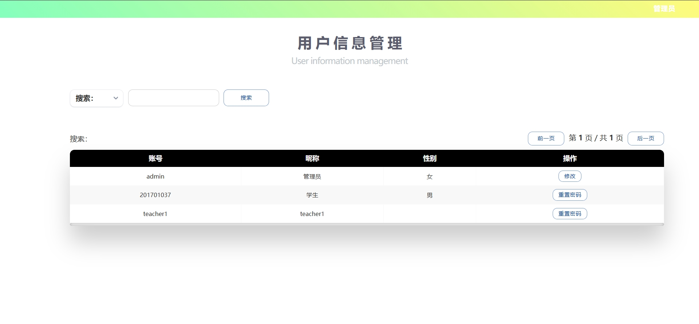
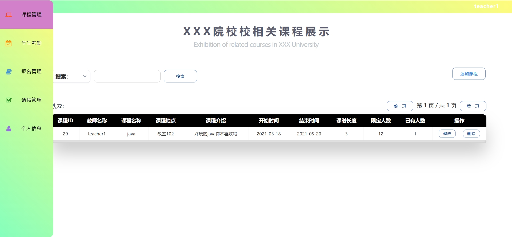
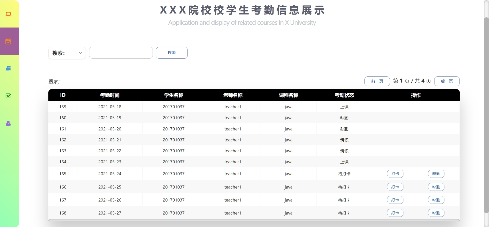
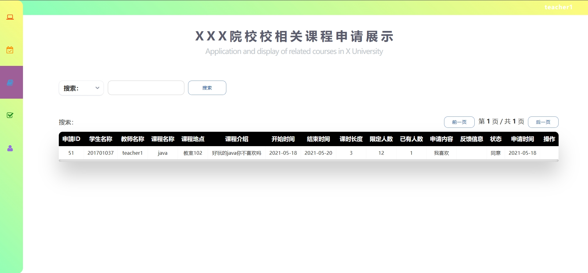
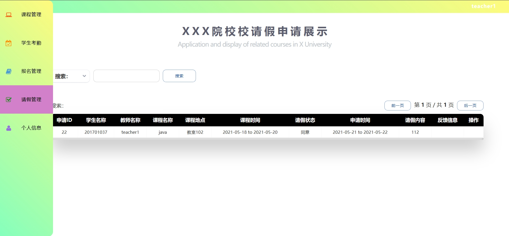
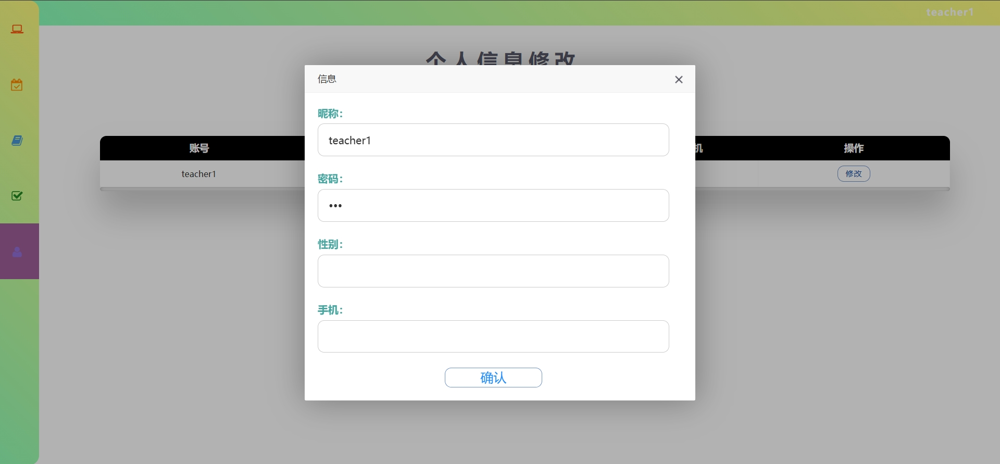
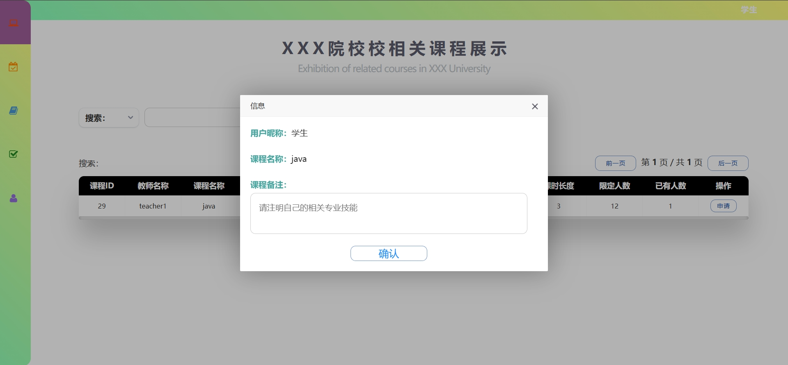
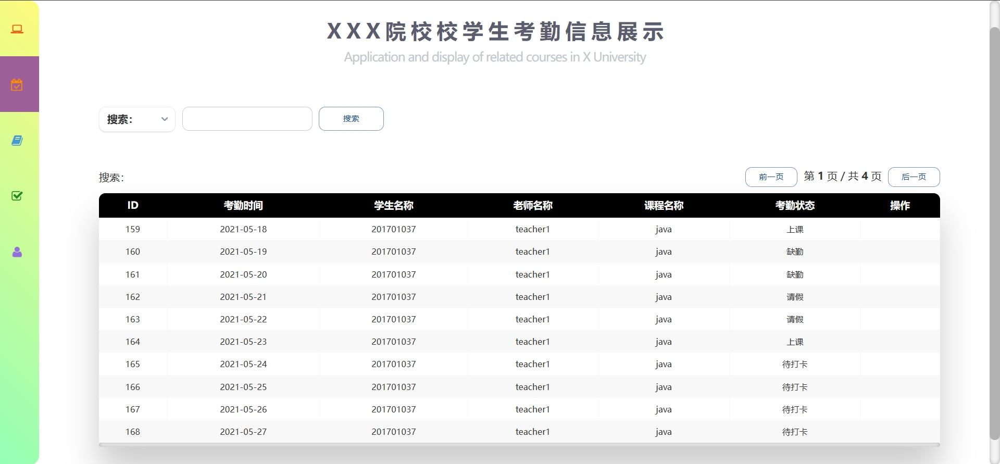
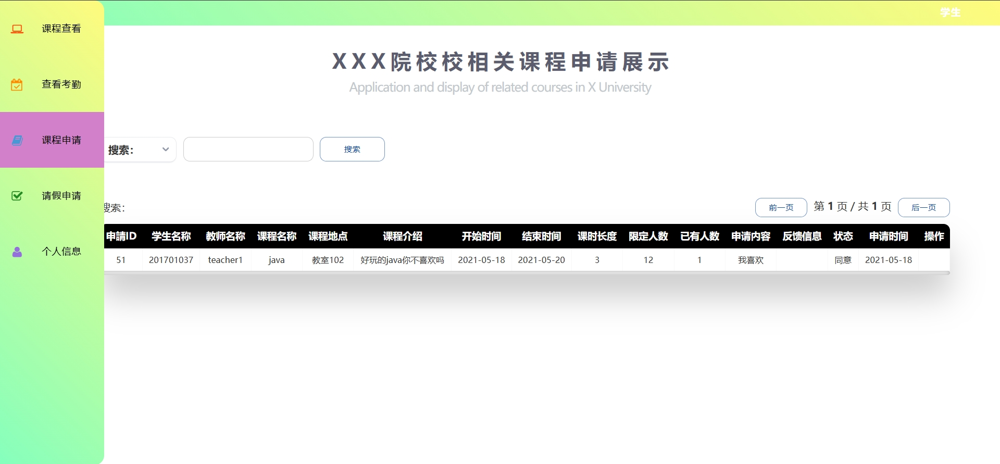
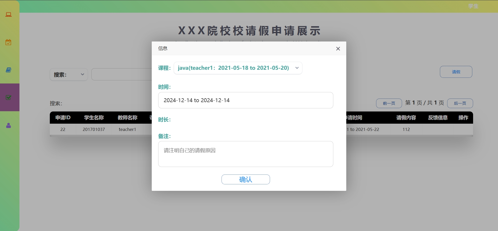

# 高校学生考勤系统(文末免费领取☟)
> 
#### 介绍
高校学生考勤系统
有BUG可留言加微

#### 软件架构
Java + SpringBoot + mybatis + thymeleaf + Mysql

#### 项目功能说明

1.  管理员功能
> + 用户信息管理
2.  教师功能
> + 登录注册
> + 课程管理
> + 学生考勤管理
> + 课程报名管理
> + 学生请假管理
> + 个人信息管理
2.  学生功能
> + 登录注册
> + 课程查看
> + 查看考勤
> + 课程申请
> + 请假申请
> + 个人信息

### 部分功能演示

### 环境需求(可免费提供)
- idea/eclipse、jdk-1.8、maven-3.8.6、mysql、nodejs等

## 有项目修改、安装调试需求 请联系以下

## 获取资源扫☝☝☝
